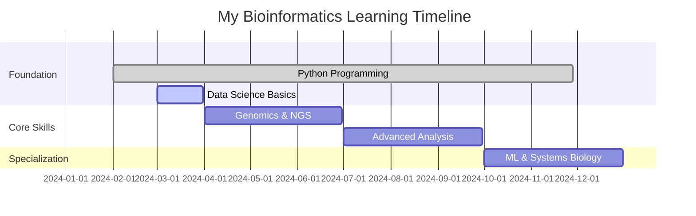

# Hey there, I'm Abdellah 👋

<div align="center">
  
  
  
  [](https://github.com/cartesianpixels)
  [](https://github.com/cartesianpixels)
  [](https://github.com/cartesianpixels)
  
</div>

---

## 🧬 About Me

```python
class BioinformaticsResearcher:
    def __init__(self):
        self.name = "Abdellah"
        self.location = "Morocco 🇲🇦"
        self.education = {
            "current": "Master's in Biology & Health",
            "focus": "Biomedical Science",
            "next": "PhD in Bioinformatics & Computational Biology"
        }
        self.achievements = [
            "US State Department Student Leaders Alumni",
            "12-Month Bioinformatics Roadmap Creator",
            "Molecular Dynamics Simulation Expert"
        ]
        self.passion = "Biology, Aviation, Vexillology"
    
    def current_focus(self):
        return [
            "🧪 Multi-omics Data Integration",
            "🤖 Machine Learning in Biology",
            "📊 Genomic Data Visualization",
            "🔬 Reproducible Research Workflows",
            "⚛️ Molecular Dynamics & Drug Design"
        ]
```

---

## 🚀 My Learning Journey

<details>
<summary><b>📈 12-Month Bioinformatics Mastery Roadmap</b></summary>

### 🎯 **Current Phase: Data Science Basics**



**Completed Milestones:**
- 🔄 Linux/Bash scripting proficiency
- 🔄 Python for bioinformatics foundation
- 🔄 Data science with NumPy/Pandas/R
- ⏳ NGS analysis pipeline development

</details>

---

## 🛠️ Tech Stack & Tools

<div align="center">

### **Programming Languages**


### **Bioinformatics & Data Science**


### **Molecular Modeling & Simulation**


### **Tools & Platforms**


</div>

---

## 📊 GitHub Analytics

<div align="center">
  


</div>

<div align="center">
  


</div>

---

## 🔬 Featured Projects

<div align="center">

[](https://github.com/cartesianpixels/airassist)
[](https://github.com/cartesianpixels/naturaDock)


</div>

---

## 🎯 Current Focus Areas

### **🧬 Research Interests**
- **Multi-omics Integration**: Combining genomics, transcriptomics, and proteomics data
- **Machine Learning in Biology**: Applying AI for biomarker discovery and drug development  
- **Molecular Dynamics Simulations**: Protein-drug interactions and conformational analysis
- **Structure-Based Drug Design**: Virtual screening and lead optimization using Maestro
- **Personalized Medicine**: Pharmacogenomics and precision therapy approaches
- **Systems Biology**: Network analysis and pathway modeling

### **📚 Currently Learning**
- Advanced NGS analysis pipelines
- Single-cell RNA-seq methods
- Deep learning for biological sequences  
- Cloud computing for genomics (AWS/GCP)
- Enhanced sampling methods in MD simulations
- AI-driven drug discovery platforms

### **🎓 Academic Goals**
- **2024**: Complete bioinformatics specialization
- **2025**: Advanced research opportunities
- **Future**: Leading research in computational biology

---

## 🌐 Connect & Collaborate

<div align="center">
  
  <a href="https://X.com/flagflieger">
    
  </a>
  <a href="https://instagram.com/flagflieger">
    
  </a>
  <a href="https://linkedin.com/in/abdellahchaaibi">
    
  </a>
  <a href="mailto:helix2algorithm@gmail.com">
    
  </a>
  <a href="https://cartesianpixels.substack.com/">
    
  </a>
  
</div>

---

## 💡 Fun Facts & Interests

- 🌍 **Global Perspective**: US State Department alumni bridging cultures through science
- 🎓 **Academic Excellence**: Pursuing cutting-edge research in computational biology
- ⚛️ **Molecular Modeling Expert**: Experienced with GROMACS and Schrödinger Maestro for drug design
- 🤝 **Collaboration**: Always open to interdisciplinary projects and research partnerships
- 📈 **Growth Mindset**: Currently on a 12-month intensive bioinformatics learning journey
- 🔬 **Research Vision**: Making biology more predictable through computational approaches

---

## 📈 Learning Progress Tracker

<div align="center">

**9-Month Bioinformatics Roadmap Progress**


| Phase | Focus Area | Progress | Status |
|-------|------------|----------|---------|
| **Phase 1** | Linux & Command Line (Months 1-2) |  | ✅ Mostly Done |
| **Phase 2** | Python Programming (Months 3-4) |  | 🔄 In Progress |
| **Phase 3** | Data Science & Stats (Months 5-6) |  | 🔄 Started (basic stats, causal inference) |
| **Phase 4** | Bioinformatics Tools (Month 7) |  | ✅ Practical exposure (Seurat, pcalg) |
| **Phase 5** | Machine Learning & AI (Month 8) |  | ⏳ Planned |
| **Phase 6** | Integration & Portfolio (Month 9) |  | 🔄 Ongoing (GitHub project, manuscript) |


</div>

---

<div align="center">
  
**⭐ Star my repositories if you find them helpful! ⭐**

</div>

---
